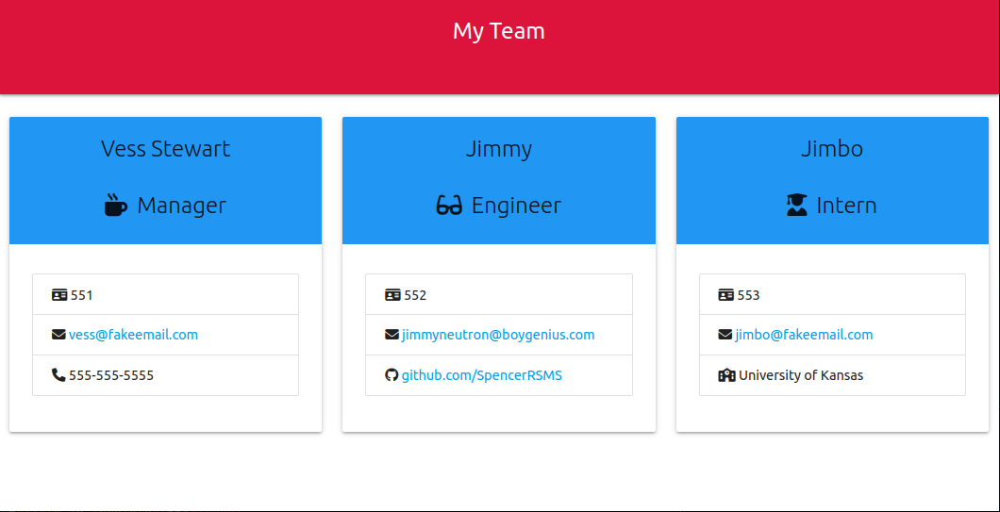

# Team Profile Generator
### Challenge 10 - KU Bootcamp

## Table of Contents

- [Description](#description)
- [Installation](#installation)
- [Usage](#usage)
- [Credits](#credits)
- [Example](#example)
- [Repo](#links)

## Description
A Node.js project that prompts the user for information regarding a team of people
(Manager, Engineers, and Interns currently). After input has been given, generates an HTML
file for simple file containing the team member information, prettied up a touch with Materialize
and Font Awesome icons.

## Installation
1 - Ensure Node.js has been properly installed

2 - Download or clone the project locally

3 - Navigate to folder via CLI

4 - Run 'npm i' to install dependencies

## Usage
1 - Navigate to folder via CLI

2 - Run 'npm start' to run the program

3 - Follow prompts within CLI

## Credits
Developed by:
Vess Stewart - [GitHub](https://github.com/SpencerRSMS)

## Features
- HTML file generation
- Utilizes mock DOM via JSDOM
- DOM manipulation via jQuery
- Jest tests for each class
- Materialize CSS
- Font Awesome
- Object Oriented Design
- E-mails links populate To: field in default service automatically
- GitHub links will pop out in new tab

## Example
#### Utilizing CLI

#### Example Output

## Links
#### [GitHub repository](https://github.com/SpencerRSMS/team-profile-generator)
